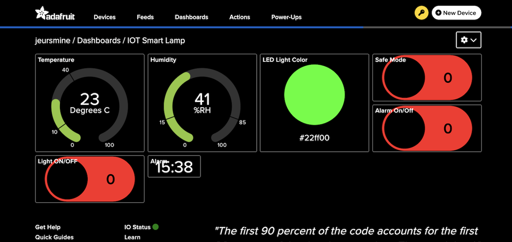
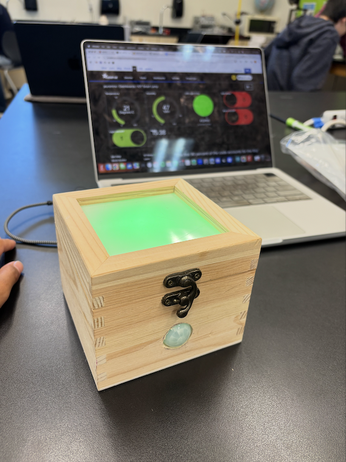
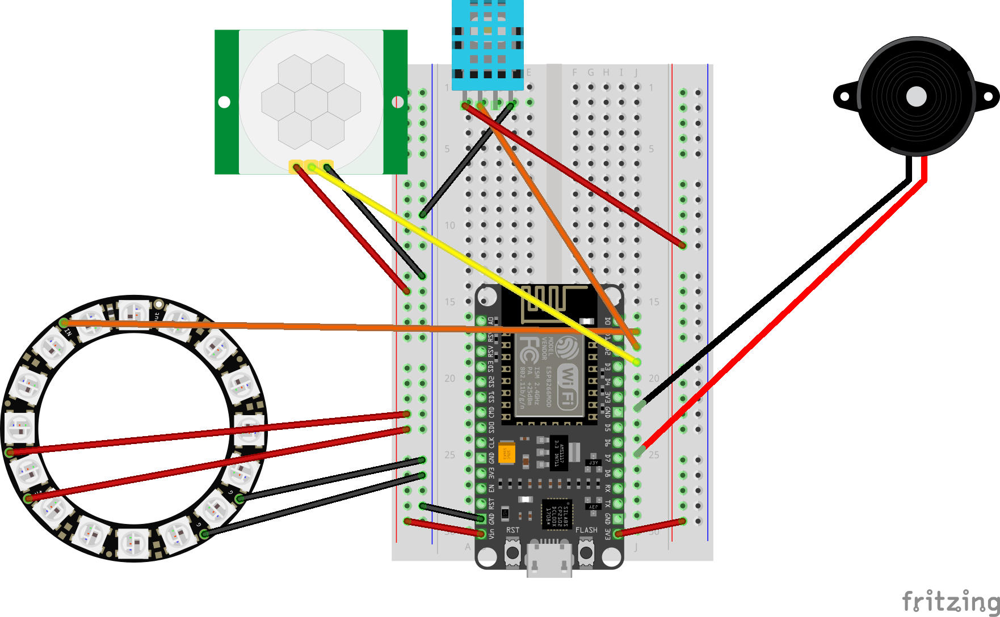
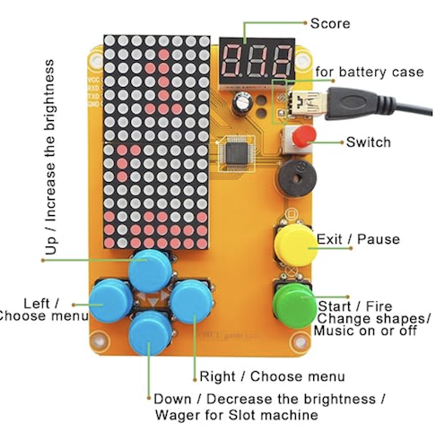

# Smart Lamp
The IoT Smart Lamp is a WiFi-connected LED system that responds to motion, temperature, and user commands from anywhere in the world via Adafruit IO. One of the biggest challenges was integrating multiple sensors (motion, temperature, LDR) and syncing them with cloud-based control, but the result is a responsive, customizable light that blends automation with real-time input from the user. Completing this project was a rewarding dive into IoT, where coding, electronics, and creativity all came together.


| Jasmine Q | Homestead High School | Bioengineering | Junior |


# Final Milestone
Insert Vid

For my final milestone, I added a 'breathing' light feature where the LED ring light pulses slowly. I mainly only had to modify the code using for loops to gradually turn the light on and off repeatedly. I didn't face any significant challenges modifying my code. 

# Third Milestone

<iframe width="560" height="315" src="https://www.youtube.com/embed/nmg4USzm_U4?si=tk98zS85_rgiffTB" title="YouTube video player" frameborder="0" allow="accelerometer; autoplay; clipboard-write; encrypted-media; gyroscope; picture-in-picture; web-share" referrerpolicy="strict-origin-when-cross-origin" allowfullscreen></iframe>

For my third milestone, I customized the wooden enclosure for my breadboard and added an alarm clock feature to my project. I started with a wooden box that had a clear lid and made physical modifications to allow the components to function properly. I drilled a hole in the back for the power cable, which was straightforward, and a more challenging hole in the front for the Fresnel lens of the motion sensor. Since the lens had a diameter of 0.9 inches, I first drilled a 0.5-inch hole, then carefully widened it using a Dremel with a sanding attachment until the lens fit securely. I also cut squares from a stencil-making sheet and glued them to the inside of the lid to serve as a light diffuser. Once these modifications were complete, I was able to place the breadboard inside and power it with no issues. Additionally, I removed the photoresistor and the resistor and wire that went along with it from my circuit, as it served no purpose in what I desired to be on my final project.

For my added feature, I decided to implement an alarm clock. I created two new feeds on Adafruit IO—“alarmonoff” to toggle the alarm and “time” to set the desired time in 24-hour format. I used a time library on Arduino to get the current time, formatted it properly and added an offset to change it to the correct time zone, and added logic so that the piezo buzzer would only ring when the current time matched the user input and the alarm was turned on. This feature added a practical function to the lamp and pushed the project closer to a fully integrated smart device.

As stated before, the only challenge I faced was drilling the 0.9in hole into my box to fit the fresnel lens on my motion detector as the dremel was a bit hard to use. 

Next, I will likely be adding another modification.

Adafruit Dashboard: 


Final Box w/ Enclosure: 




# Second Milestone

<iframe width="560" height="315" src="https://www.youtube.com/embed/3EwdzHdmWwI?si=o8iDqPQbelvet3K9" title="YouTube video player" frameborder="0" allow="accelerometer; autoplay; clipboard-write; encrypted-media; gyroscope; picture-in-picture; web-share" referrerpolicy="strict-origin-when-cross-origin" allowfullscreen></iframe>

For my second milestone, I successfully integrated all components of my smart lamp into a unified system that delivers full functionality. I also connected the project to Adafruit IO, a cloud-based platform for data communication and IoT device control. Using Adafruit IO, I created multiple data feeds to send and receive information between the lamp and the user interface on the Adafruit dashboard. My code was designed to both update these feeds with real-time sensor data and respond to user inputs—such as button presses and toggle switches—on the Adafruit IO Dashboard. This enabled seamless two-way interaction: users can remotely control the smart lamp and receive live system feedback via the dashboard. 

Key features implemented include:

    -Safe Mode: When toggled on via the dashboard, this mode triggers an email alert and activates a buzzer alarm if motion is detected in the room.

    -Multicolor LED Ring: Users can select any desired color for the LED ring through the dashboard.

    -Temperature and Humidity Monitoring: The system displays real-time temperature and humidity data and sends email notifications if values go above or below specified thresholds.

    -Master Light Switch: When off, all lights are disabled. When on, the lamp will automatically turn on if motion is detected and remain on until the switch is turned off.

One major challenge I encountered was inconsistent readings from the temperature and humidity sensor—it would occasionally return extreme or invalid values (e.g., negatives or values in the millions). To solve this, I implemented a filtering system using a while loop that rejects unrealistic values and only accepts valid sensor readings. I also added a short delay before the initial reading to allow the sensor time to calibrate properly.

Next, I plan to add more features (still to be determined) and begin designing and building the enclosure for the smart lamp. I may also consider removing the motion-sensing feature from the LED light, depending on further testing and feedback.

# First Milestone

<iframe width="560" height="315" src="https://www.youtube.com/embed/_4Cy8AbWqvQ?si=k65Cnbasy8dO3p2p" title="YouTube video player" frameborder="0" allow="accelerometer; autoplay; clipboard-write; encrypted-media; gyroscope; picture-in-picture; web-share" referrerpolicy="strict-origin-when-cross-origin" allowfullscreen></iframe>


For my first milestone, I essentially tested all of the sensors and components on my breadboard individually before wiring them all up together onto the circuit(see schematics). 

My IoT Smart Lamp integrates several sensors and components, including the DHT11 (temperature/humidity sensor), HC-SR501 (motion detector), photoresistor (light sensor), a NeoPixel 12-LED ring, and an ESP8266 microcontroller.

The project mainly relies on the ESP8266, a Wi-Fi-enabled microcontroller that allows all connected components to send and receive data over the internet. The DHT11 sensor measures both temperature and humidity. It uses a humidity sensor (which detects changes in capacitance) and a thermistor (which detects temperature changes via resistance). These readings are processed internally and output as digital data. The HC-SR501 motion sensor uses infrared to detect motion by sensing heat changes in its surroundings, signaling when movement is detected. The NeoPixel ring consists of 16 individually addressable RGB LEDs, each with its own integrated circuit. This allows for custom color and brightness control, adding a visual and aesthetic element to the lamp. Lastly, the photoresistor (or light-dependent resistor) adjusts brightness based on ambient light levels by varying its resistance depending on light exposure.

Together, these components provide a functional and customizable smart lamp system:

    -The DHT11 allows the user to monitor room temperature and humidity.
       
    -The HC-SR501 enables motion detection and potential intruder alerts.
         
    -The NeoPixel ring offers customizable ambient lighting.
    
    -The photoresistor automatically adjusts brightness based on room lighting conditions.

One of the biggest challenges I faced was that the tutorial I was originally provided used the Cayenne IoT platform, which has since shut down. This required me to search for alternative resources and experiment independently to determine the best way to wire my circuit and test individual components. Additionally, as someone with limited prior experience in physical computing and circuit wiring, I encountered some trial-and-error issues during setup. However, in the end, I was able to get the circuit functioning correctly, and found Adafruit IO to be a good platform for the user interface for my lamp.

In the next milestone, I will focus on uploading and integrating all the code needed to make the components work together. I will also create an Adafruit IO dashboard, allowing the user to:

    -View real-time temperature, humidity, motion, and brightness data
  
    -Customize the color of the lamp through the NeoPixel ring
  
    -Receive automated email alerts for abnormal temperature/humidity levels
  
    -Be notified when motion is detected while the lamp is in “safe mode”
  
By the end of the next milestone, the smart lamp will be fully functional, customizable, and interactive through a clean, user-friendly IoT interface.

# Schematics 


# Code
Main Code: 
```c++
#include "config.h"
#include "Adafruit_NeoPixel.h"
#include <DHT.h>
#include <time.h>

#define RING_PIN            D1
#define RING_PIXEL_COUNT    16
#define PIXEL_TYPE          NEO_GRB + NEO_KHZ800

#define TEMP_DELAY          7

#define DHTPIN              D2
#define DHTTYPE             DHT11

#define BUZZER_PIN          D7
#define MOTION_PIN          D3

int temperatureData;
int humidityData;
int lastMotionState = digitalRead(MOTION_PIN);
long colorcode = 0xFFFFFF;
String safemodeState = "0";

Adafruit_NeoPixel ring = Adafruit_NeoPixel(RING_PIXEL_COUNT, RING_PIN, PIXEL_TYPE);
DHT dht(DHTPIN, DHTTYPE);

// Adafruit IO Feeds
AdafruitIO_Feed *lights = io.feed("lights");
AdafruitIO_Feed *humidity = io.feed("humidity");
AdafruitIO_Feed *temperature = io.feed("temperature");
AdafruitIO_Feed *buzzer = io.feed("buzzer");
AdafruitIO_Feed *motion = io.feed("motion");
AdafruitIO_Feed *safemode = io.feed("safemode");
AdafruitIO_Feed *lightonoff = io.feed("lightonoff"); 
AdafruitIO_Feed *alarmonoff = io.feed("alarmonoff");
AdafruitIO_Feed *timeonoff = io.feed("timeonoff");
AdafruitIO_Feed *breathing = io.feed("breathing");  

long lightColor = 0;
bool lightOn = false;
bool masterLightEnabled = true; 

String alarmTime = "";    
bool alarmEnabled = false;
bool alarmRinging = false;
bool alarmTurnedOnLights = false;
bool breathingEnabled = false;  

void waitForTime() {
  Serial.print("Waiting for time sync for alarm");
  time_t now = time(nullptr);
  while (now < 8 * 3600 * 2) {
    delay(500);
    Serial.print(".");
    now = time(nullptr);
  }
  Serial.println(" Time synced.");
}

void setup() {
  Serial.begin(115200);
  while (!Serial);

  Serial.print("Connecting to Adafruit IO");
  io.connect();

  lights->onMessage(lightHandler);
  buzzer->onMessage(buzzerHandler);
  safemode->onMessage(safemodeHandler);
  lightonoff->onMessage(lightonoffHandler);
  alarmonoff->onMessage(alarmonoffHandler);
  timeonoff->onMessage(timeonoffHandler);
  breathing->onMessage(breathingHandler); 

  while (io.status() < AIO_CONNECTED) {
    Serial.print(".");
    delay(500);
  }
  Serial.println();

  configTime(-7 * 3600, 0, "pool.ntp.org", "time.nist.gov");

  waitForTime();

  Serial.print("Current time after sync: ");
  Serial.println(getCurrentTimeString());

  Serial.println(io.statusText());

  dht.begin();
  delay(2000);
  ring.begin();

  pinMode(BUZZER_PIN, OUTPUT);
  digitalWrite(BUZZER_PIN, LOW);
  pinMode(MOTION_PIN, INPUT);

  safemode->get();
  lightonoff->get();
  alarmonoff->get();
  timeonoff->get();
  breathing->get(); 
}

void loop() {
  io.run();

  if (alarmEnabled) {
    String currentTime = getCurrentTimeString();

    Serial.print("Current time: ");
    Serial.println(currentTime);
    Serial.print("Alarm time: ");
    Serial.println(alarmTime);

    if (!alarmRinging && currentTime == alarmTime) {
      Serial.println("Alarm time reached! Starting buzzer.");
      alarmRinging = true;

      for (int i = 0; i < RING_PIXEL_COUNT; i++) {
        ring.setPixelColor(i, colorcode);
      }
      ring.show();

      alarmTurnedOnLights = !lightOn;
      lightOn = true;

      Serial.println("Lights on for alarm.");
    }

    if (alarmRinging) {
      digitalWrite(BUZZER_PIN, HIGH);
    }
  } else {
    if (alarmRinging) {
      Serial.println("Alarm disabled, stopping buzzer/working w lights.");
      alarmRinging = false;
      digitalWrite(BUZZER_PIN, LOW);

      if (alarmTurnedOnLights) {
        for (int i = 0; i < RING_PIXEL_COUNT; i++) {
          ring.setPixelColor(i, 0);
        }
        ring.show();
        lightOn = false;
        Serial.println("Alarm turned off the lights they enabled.");
      } else {
        Serial.println("Alarm ended, but user lights remain on.");
      }

      alarmTurnedOnLights = false;
    }
  }

  if (breathingEnabled && masterLightEnabled) {
    for (int b = 0; b < 256; b += 5) {
      int r = (uint8_t)((colorcode >> 16) & 0xFF) * b / 255;
      int g = (uint8_t)((colorcode >> 8) & 0xFF) * b / 255;
      int b_ = (uint8_t)(colorcode & 0xFF) * b / 255;

      for (int i = 0; i < RING_PIXEL_COUNT; i++) {
        ring.setPixelColor(i, r, g, b_);
      }
      ring.show();
      delay(40);
    }
    for (int b = 255; b >= 0; b -= 5) {
      int r = (uint8_t)((colorcode >> 16) & 0xFF) * b / 255;
      int g = (uint8_t)((colorcode >> 8) & 0xFF) * b / 255;
      int b_ = (uint8_t)(colorcode & 0xFF) * b / 255;

      for (int i = 0; i < RING_PIXEL_COUNT; i++) {
        ring.setPixelColor(i, r, g, b_);
      }
      ring.show();
      delay(40);
    }
    return;
  } else if (masterLightEnabled && lightOn) {
    for (int i = 0; i < RING_PIXEL_COUNT; i++) {
      ring.setPixelColor(i, colorcode);
    }
    ring.show();
  }

  delay(7000);

  float t = dht.readTemperature(false);
  float h = dht.readHumidity(false);

  while (t <= 1 || h <= 1) {
    Serial.println("space");
    t = dht.readTemperature(false);
    h = dht.readHumidity(false);
  }

  if (isnan(t) || isnan(h)) {
    Serial.println("Invalid DHT sensor readings, skipping this cycle.");
    return;
  }

  temperatureData = t - 5;
  humidityData = h;

  Serial.print("Sending Temperature to Adafruit IO: ");
  Serial.println(temperatureData);
  Serial.print("Sending Humidity to Adafruit IO: ");
  Serial.println(humidityData);

  temperature->save(temperatureData);
  humidity->save(humidityData);

  int motionState = digitalRead(MOTION_PIN);

  if (motionState != lastMotionState) {
    lastMotionState = motionState;

    if (motionState == HIGH) {
      Serial.println("Motion Detected!");
      motion->save(String("1"));

    

      if (safemodeState == "1") {
        digitalWrite(BUZZER_PIN, HIGH);
        delay(5000);
        digitalWrite(BUZZER_PIN, LOW);
      }
    } else {
      Serial.println("No Motion Detected.");
      lightOn = false;
      motion->save(String("0"));
    }
  } else {
    if (motionState == HIGH) {
      Serial.println("Motion STILL Detected.");
      if (safemodeState == "1") {
        digitalWrite(BUZZER_PIN, HIGH);
        delay(5000);
        digitalWrite(BUZZER_PIN, LOW);
      }

      

    } else {
      Serial.println("Still No Motion.");
      lightOn = false;
      digitalWrite(BUZZER_PIN, LOW);
    }
  }

  if (masterLightEnabled && !lightOn && !breathingEnabled) {
    for (int i = 0; i < RING_PIXEL_COUNT; i++) {
      ring.setPixelColor(i, colorcode);
    }
    ring.show();
    lightOn = true;
    Serial.println("Lights auto-on due to master switch (no motion needed).");
  }
}

void lightHandler(AdafruitIO_Data *data) {
  delay(1000);
  Serial.print("light HEX: ");
  Serial.println(data->value());

  lightColor = data->toNeoPixel();
  colorcode = lightColor;

  if (!masterLightEnabled) {
    Serial.println("Master light is OFF, ignoring color change.");
    return;
  }

  lightOn = (lightColor != 0);

  for (int i = 0; i < RING_PIXEL_COUNT; i++) {
    ring.setPixelColor(i, lightColor);
  }
  ring.show();
}

void buzzerHandler(AdafruitIO_Data *data) {
  String command = data->toString();
  Serial.print("Buzzer command received: ");
  Serial.println(command);

  if (command == "1") {
    digitalWrite(BUZZER_PIN, HIGH);
    delay(5000);
    digitalWrite(BUZZER_PIN, LOW);
    buzzer->save(String("0"));
  } else {
    buzzer->save(String("0"));
    digitalWrite(BUZZER_PIN, LOW);
  }
}

void safemodeHandler(AdafruitIO_Data *data) {
  safemodeState = data->toString();
}

void lightonoffHandler(AdafruitIO_Data *data) {
  String val = data->toString();
  Serial.print("Master light switch: ");
  Serial.println(val);

  if (val == "0") {
    masterLightEnabled = false;
    for (int i = 0; i < RING_PIXEL_COUNT; i++) {
      ring.setPixelColor(i, 0);
    }
    ring.show();
    lightOn = false;
    Serial.println("Master light OFF: All lights disabled.");
  } else {
    masterLightEnabled = true;
    if (lightColor != 0) {
      for (int i = 0; i < RING_PIXEL_COUNT; i++) {
        ring.setPixelColor(i, lightColor);
      }
      ring.show();
      lightOn = true;
    }
    Serial.println("Master light ON: Lighting re-enabled.");
  }
}

void alarmonoffHandler(AdafruitIO_Data *data) {
  String val = data->toString();
  Serial.print("Alarm ON/OFF set to: ");
  Serial.println(val);

  alarmEnabled = (val == "1");

  if (!alarmEnabled) {
    alarmRinging = false;
    digitalWrite(BUZZER_PIN, LOW);

    if (alarmTurnedOnLights) {
      for (int i = 0; i < RING_PIXEL_COUNT; i++) {
        ring.setPixelColor(i, 0);
      }
      ring.show();
      lightOn = false;
      Serial.println("Alarm turned off lights that it enabled.");
    } else {
      Serial.println("Alarm ended, but user lights remain on.");
    }

    alarmTurnedOnLights = false;
  }
}

void timeonoffHandler(AdafruitIO_Data *data) {
  alarmTime = data->toString();
  Serial.print("Alarm time set to: ");
  Serial.println(alarmTime);
}

void breathingHandler(AdafruitIO_Data *data) {
  String val = data->toString();
  Serial.print("Breathing mode set to: ");
  Serial.println(val);
  breathingEnabled = (val == "1");
}

String getCurrentTimeString() {
  time_t now = time(nullptr);
  struct tm *timeinfo = localtime(&now);
  char buffer[6];
  sprintf(buffer, "%02d:%02d", timeinfo->tm_hour, timeinfo->tm_min);
  return String(buffer);
}

```
Config.h code(YOU WILL NEED A NEW TAB ON ARDUINO FOR THIS)
```c++
/************************ Adafruit IO Config *******************************/

// visit io.adafruit.com if you need to create an account,
// or if you need your Adafruit IO key.
#define IO_USERNAME "REPLACE WITH YOUR ADAFRUIT IO USERNAME"
#define IO_KEY "REPLACE WITH YOUR ADAFRUIT IO USER KEY"

/******************************* WIFI **************************************/


#define WIFI_SSID "REPLACE WITH THE NAME OF YOUR WIFI"
#define WIFI_PASS "REPLACE WITH YOUR WIFI PASSWORD"

#include "AdafruitIO_WiFi.h"
#include <ESP8266WiFi.h>

#if defined(USE_AIRLIFT) || defined(ADAFRUIT_METRO_M4_AIRLIFT_LITE) ||         \
    defined(ADAFRUIT_PYPORTAL)
#if !defined(SPIWIFI_SS) 
#define SPIWIFI SPI
#define SPIWIFI_SS 10 
#define NINA_ACK 9   
#define NINA_RESETN 6 
#define NINA_GPIO0 -1 
#endif
AdafruitIO_WiFi io(IO_USERNAME, IO_KEY, WIFI_SSID, WIFI_PASS, SPIWIFI_SS,
                   NINA_ACK, NINA_RESETN, NINA_GPIO0, &SPIWIFI);
#else
AdafruitIO_WiFi io(IO_USERNAME, IO_KEY, WIFI_SSID, WIFI_PASS);
#endif

```
# Starter Project- Retro Arcade Console
<iframe width="560" height="315" src="https://www.youtube.com/embed/hvmn-ZRGc-s?si=3SyQsaWPOCVCY1et" title="YouTube video player" frameborder="0" allow="accelerometer; autoplay; clipboard-write; encrypted-media; gyroscope; picture-in-picture; web-share" referrerpolicy="strict-origin-when-cross-origin" allowfullscreen></iframe>
Components: 1 buzzer, 1 electric capacitator, 1 micro USB, 1 power cable, 1 self-switch, 1 self-switch cap, 1digitron display, 1IC chip, 2 LED dot matrix modules, 6 buttons, 6 button caps, 1 PCB, 8 M3x5mm screws, 2 M3x8mm screws, 4 copper columns, 4 hexagonal columns, 1 AAA battery case, and 6 arcrylis shells.

How it works: The retro arcade console is a beginner-friendly DIY electronics project. It includes a pre-designed printed circuit board (PCB) and various electronic components like LEDs, resistors, and buttons. Users solder the components onto the PCB following clear instructions. Once assembled and powered, the kit functions as a mini interactive arcade display where the user can play various different retro arcade games such as Tetris and Snake. It's designed to help beginners practice soldering while creating a fun, working gadget.

Button Functions: 



Challenges: The retro arcade console was relatively easy to assemble. The soldering was simple and was just slightly tedious due to the number of joints that needed to be made. The main challenge for me was figuring out how to connect the battery back to the PCB, given unclear instructions. Other than that, no challenges were faced. 

# Bill of Materials(Intensive Project)

| **Part** | **Note** | **Price** | **Link** |
|:--:|:--:|:--:|:--:|
| NODEMCU ESP8266 | Microcontroller Board with Wifi | $7.99	 | <a href="https://www.amazon.com/dp/B010O1G1ES/ref=twister_B086QGXBRW?_encoding=UTF8&psc=1"> Link </a> |
| DHT11	 | Temperature and Humidity Sensor | $9.99 | <a href="https://www.amazon.com/Adafruit-temperature-humidity-sensor-extras-ADA386/dp/B00NAY22V8"> Link </a> |
| NeoPixel Ring (16 LEDs) | Colorful Light with RGB | $14.41 | <a href="https://www.amazon.com/Adafruit-NeoPixel-Ring-Integrated-Drivers/dp/B00KBXT9I0"> Link </a> |
| PIR Sensor | Motion Sensor | $11.99	 | <a href="(https://www.amazon.com/Adafruit-LK-918O-SANV-FBACA-PIR-Motion-Sensor/dp/B00JOZTAC6)"> Link </a> |
| LDR Sensor | Light Sensor | $7.99	 | <a href="https://www.amazon.com/BOJACK-Photoresistance-Sensitive-Resistor-GM5539/dp/B07TQMJ212/ref=sr_1_3?crid=30NPCKYPA4HL4&keywords=ldr+sensor&qid=1689181779&sprefix=ldr+sensor+adafruit%2Caps%2C184&sr=8-3"> Link </a> |
| Buzzer | Sends High Low Signals | $6.98	 | <a href="https://www.amazon.com/Cylewet-Electronic-Magnetic-Continuous-Arduino/dp/B01N7NHSY6/ref=sr_1_3?crid=WN57I7A8ZBMC&keywords=buzzer+electronics&qid=1689180534&sprefix=buzzer+elec%2Caps%2C150&sr=8-3"> Link </a> |
| Male to Male Wires | Wiring Components | $9.99	 | <a href="https://www.amazon.com/Elegoo-EL-CP-004-Multicolored-Breadboard-arduino/dp/B01EV70C78/ref=sr_1_4?crid=2E8KWUHA2SB4V&keywords=male%2Bto%2Bmale%2Bwires&qid=1689182362&sprefix=male%2Bto%2Bmale%2Bwires%2Caps%2C172&sr=8-4&th=1"> Link </a> |
| Female to Male Wires | Wiring Components | $9.99	 | <a href="https://www.amazon.com/Elegoo-EL-CP-004-Multicolored-Breadboard-arduino/dp/B01EV70C78/ref=sr_1_4?crid=2E8KWUHA2SB4V&keywords=male%2Bto%2Bmale%2Bwires&qid=1689182362&sprefix=male%2Bto%2Bmale%2Bwires%2Caps%2C172&sr=8-4&th=1"> Link </a> |
| Breadboard | Prototyping and Base for Circuit | $12.99	 | <a href="https://www.amazon.com/EL-CP-003-Breadboard-Solderless-Distribution-Connecting/dp/B01EV6LJ7G/ref=sr_1_4crid=2JO3WCBVW2ZO5&keywords=breadboard&qid=1689182601&sprefix=breadboar%2Caps%2C152&sr=8-4&th=1"> Link </a> |
| Wooden Box | Enclosure | $22.99	 | <a href="https://www.amazon.com/Geytetqi-Pack-7-87-4-72-inch/dp/B0DTTKGXPP/ref=sr_1_11?dib=eyJ2IjoiMSJ9.wlmkyfo4gIs-b-ACzI74fuXDdSrPiWo4PSg6sk9FLdt9oFnDs6XeuvJwzW2U22UMI6w0ca3SR5svorIJ6JoK0mfUSgUr9lbiXtD4HhTeq4u2sZALSB4P9AVY4VnQcnwZD_jFP2Lqi-LHEdlN5fz7GGCHezwsKsMgGRNN8i8cqNTiN5C0MuixRYd4ZXG6159LJEm8NYWFV7nBc1rK2u1fqWwp7FqCEuWf2W1LJgOlCR8CFpjdeTDwwo_pXjSCFsZRApetKdIR0cbw6MhMsLij4G_HW07i6DkNXaACl-7baLo.sY6vPhbvh56CSisOyserILJ0XHiRTUMKhLzLwfFS_zs&dib_tag=se&keywords=wooden%2Bbox%2Bwith%2Bglass%2Btop&qid=1751928816&sr=8-11&th=1"> Link </a> |
| Stencil Making Sheet | Diffusing Light | $13.99	 | <a href="https://www.amazon.com/Translucent-Stencil-Gyro-Cut-Template-Material/dp/B08PVYHH4M/ref=sr_1_5crid=2WLCSK4EWCFYZ&keywords=banltre+10+sheets+10+mil+mylar+sheet&qid=1689809595&sprefix=banltre+%2Caps%2C132&sr=8-5"> Link </a> |


